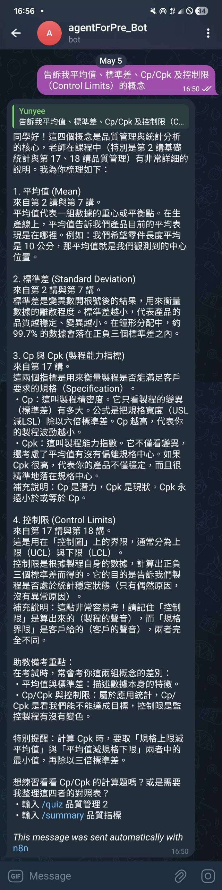

# PrepAgent — Telegram AI 備考助教與 RAG 知識庫

將唐麗英老師 YouTube 統計學課程轉化為可對話的 Telegram AI 備考助教。
使用者可透過 Telegram 指令進行概念問答、生成練習題、整理重點筆記。
全雲端架構，本機關機後服務仍持續運行。



---

## 系統架構

```
YouTube 課程影片
      │
      │  Whisper（本地語音轉文字）
      ▼
  data/*.txt（逐字稿，29 份）
      │
      │  Python ingestion pipeline
      │  gemini-embedding-001（3072 維）
      ▼
Supabase pgvector（halfvec + ivfflat 索引）
      │
      │  n8n Cloud Workflow
      ▼
Telegram Trigger
  → Switch（/ask / /quiz / /summary）
  → AI Agent
      ├─ LLM: Gemini 2.0 Flash
      ├─ Memory: Window Buffer（5 輪對話）
      └─ Tool: Supabase Vector Store（top-k=5，餘弦相似度）
  → Telegram 回覆
```

---

## 技術棧

| 層次 | 技術 | 說明 |
|------|------|------|
| 語音轉文字 | OpenAI Whisper | 本地執行，將課程音訊轉為逐字稿 |
| 向量嵌入 | `gemini-embedding-001`（3072 維） | v1beta REST API 直接呼叫 |
| 向量庫 | Supabase pgvector（`halfvec(3072)`） | ivfflat + halfvec_cosine_ops 索引 |
| LLM | Google Gemini 2.0 Flash | n8n 內建節點 |
| 工作流程 | n8n Cloud | Telegram 觸發、路由、AI Agent 執行 |
| 介面 | Telegram Bot | 使用者對話入口 |
| Ingestion | Python 3.12 + requests | 一次性本地執行 |

---

## 資料準備：Whisper 語音轉文字

課程逐字稿由 OpenAI Whisper 在本地轉錄，共處理 29 支課程影片：

- **統計學基礎**（Lec01–Lec16）：16 講
- **統計學進階**（ProLec01–ProLec13）：13 講

Whisper 輸出格式為每行 `行號\t文字`（例如 `1\t各位同學大家好`），由 `chunker.py` 的 `_parse_lines()` 剝離行號前綴後進行分塊。

---

## 檔案結構

```
agentForPre/
├── .env.example              # 環境變數範本
├── supabase_schema.sql       # 建表 SQL（每次重建時在 Supabase SQL Editor 執行）
│
├── harness/                  # Python Ingestion Harness
│   ├── config.py             # SUBJECTS 設定、分塊與嵌入參數
│   ├── chunker.py            # chunk_file() — 逐字稿分塊
│   ├── ingest.py             # 主程式：讀取 → 分塊 → 嵌入 → 寫入 Supabase
│   ├── verify.py             # 驗證：row count + 測試 RAG 查詢
│   └── requirements.txt
│
├── n8n/                      # n8n Workflow 相關
│   └── (system_prompt 已整合至本 README)
│
├── data/                     # Whisper 逐字稿（原始檔）
│   ├── Lec01.txt … Lec16.txt
│   └── ProLec01.txt … ProLec13.txt
│
└── img/                      # 截圖
```

---

## 快速開始

### 1. 環境變數

複製 `.env.example` 為 `.env` 並填入金鑰：

```bash
cp .env.example .env
```

```
GOOGLE_API_KEY=       # Google AI Studio — Embedding + n8n Gemini LLM
SUPABASE_URL=         # https://xxx.supabase.co
SUPABASE_SERVICE_KEY= # service_role key（有 INSERT 權限，非 anon key）
```

### 2. 建立 Supabase Schema

到 Supabase 專案的 **SQL Editor**，貼上並執行 `supabase_schema.sql`。

> 注意：每次變更向量維度或型別都需要重新執行（`drop table` 重建，無法 `alter column`）。

### 3. 安裝 Python 依賴

```bash
cd harness
pip install -r requirements.txt
```

### 4. 執行 Ingestion

```bash
# 一次性匯入全部逐字稿
python ingest.py

# 只匯入特定科目
python ingest.py --subject statistics

# 只匯入單一講次
python ingest.py --file Lec08

# 清除後重新匯入
python ingest.py --subject statistics --clear

# 驗證資料與 RAG 查詢是否正常
python verify.py
```

---

## n8n Workflow 設定

在 n8n Cloud 建立以下 Workflow 結構：

```
Telegram Trigger
  → Switch（依指令路由）
  → AI Agent
      Model: Gemini 2.0 Flash（Google AI Studio key）
      Memory: Window Buffer Memory（Last 5 messages）
      Tool: Supabase Vector Store
              Function: match_documents
              Top K: 5
              Embedding: Google text-embedding-004（n8n 內建）
  → Telegram Send Message
```

### System Prompt（複製貼至 AI Agent 節點的 System Message 欄位）

```
你是唐麗英老師統計學課程的 AI 備考助教，使用繁體中文回答。

【回答規則】
1. 回答概念問題時，請引用「來自第X講」讓同學知道出處。
2. 若使用者輸入 /quiz，請根據搜尋到的內容生成 N 道選擇題，每題含四個選項、標明正確答案與解析。
3. 若使用者輸入 /summary，請整理成條列式重點筆記，標示一級標題、二級要點。
4. 若知識庫中找不到足夠相關的內容，請誠實告知，不要捏造。
5. 課程講義以口語為主，若講義說法不夠精確或與統計學標準定義有出入，請以正確統計學為準，並可補充更嚴謹的說明（標示「補充說明」）。
6. 保持親切、鼓勵的口吻，像助教陪同學一起備考。
7. 不需要每次自我介紹，直接回答問題即可。
8. 回覆時禁止使用任何 Markdown 格式（不用粗體、斜體、標題、清單符號、分隔線）。
   請用純文字、自然段落方式回答，條列時用「1. 2. 3.」或「・」代替。

【指令格式】
/ask 問題       → Q&A 模式
/quiz 主題 N題  → 出 N 道練習題
/summary 主題   → 生成重點整理
/help           → 顯示指令說明
```

---

## 關鍵技術決策

### Embedding：直接呼叫 REST API，不用 SDK

Google Python SDK（`google-generativeai` / `google-genai`）在 AI Studio API key 下固定走 `v1beta`，但 SDK 版本與 embedding 模型間存在相容性問題。改以 `requests` 直接 POST `v1beta` endpoint，繞過 SDK 限制：

```
https://generativelanguage.googleapis.com/v1beta/models/gemini-embedding-001:embedContent
```

### 向量型別：`halfvec` 而非 `vector`

`gemini-embedding-001` 輸出 3072 維，超過 pgvector `ivfflat` 對 `vector` 型別的 2000 維上限。改用 `halfvec`（16-bit float），ivfflat 支援上限為 4000 維（3072 < 4000），同時節省 50% 儲存空間，語意搜尋精度差異可忽略。

### 分塊策略：滑動視窗

每 20 行為一個 chunk，前後 5 行 overlap，保留跨句語意連貫性，避免概念在邊界被截斷。

---

## 新增科目 SOP

1. 建立 `data/<科目>/` 資料夾，放入 Whisper 逐字稿
2. 在 `harness/config.py` 的 `SUBJECTS` 字典新增條目
3. 執行 `python ingest.py --subject <key>`
4. n8n System Prompt 加入對應的科目切換邏輯

---

## 已知陷阱

| 問題 | 原因 | 解法 |
|------|------|------|
| SDK embedding 失敗 | AI Studio key 強制走 `v1beta`，模型相容性不穩定 | 改用 REST API 直接呼叫 |
| ivfflat 建索引失敗 | `vector` 型別限制 2000 維 | 改用 `halfvec(3072)` |
| 修改維度後查詢異常 | `alter column` 無法改 vector 維度 | `drop table` 後重建 schema |
| Ingestion 無寫入權限 | 使用 anon key | 改用 service_role key |
