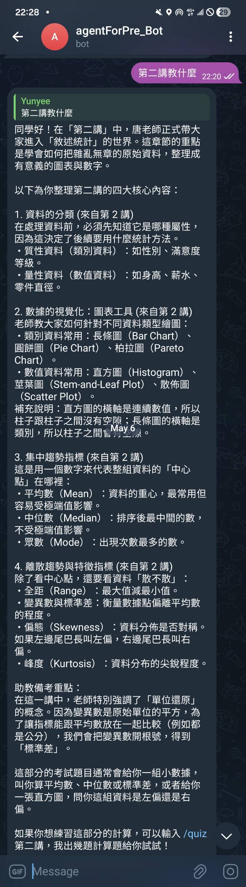
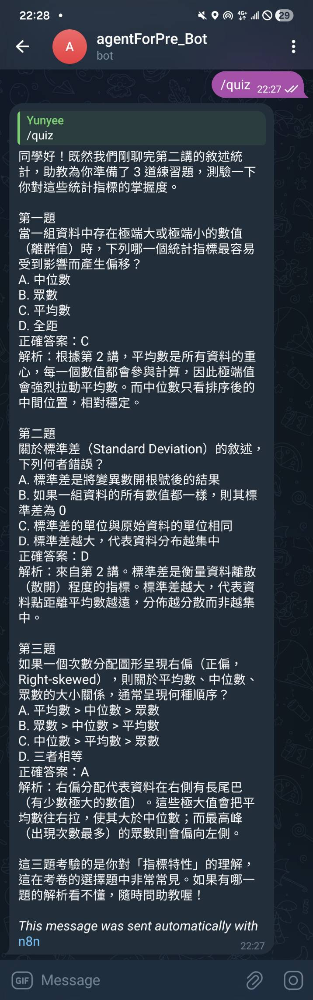

# PrepAgent — Telegram AI 備考助教與 RAG 知識庫

將唐麗英老師 YouTube 統計學課程轉化為可對話的 Telegram AI 備考助教。
使用者可透過 Telegram 指令進行概念問答、生成練習題、整理重點筆記。
全雲端架構，本機關機後服務仍持續運行。

| | |
|---|---|
|  |  |

*上下文記憶展示：先問「第二講教什麼」，之後只輸入 `/quiz` 不帶主題，
助教記得剛聊完第二講，自動出對應的練習題。*

---

## 系統架構

```
YouTube 課程影片
      │
      │  Whisper（本地語音轉文字）
      ▼
  data/*.txt（逐字稿，29 份）
      │
      │  Python ingestion pipeline
      │  gemini-embedding-001（3072 維）
      ▼
Supabase pgvector（halfvec + ivfflat 索引）
      │
      │  Supabase Edge Function（telegram-bot, Deno/TypeScript）
      ▼
Telegram Webhook
  → 指令路由（/ask / /quiz / /summary / /subject / /help）
  → RAG 檢索（gemini-embedding-001 query embedding → match_documents, top-k=5，依科目過濾）
  → Gemini 2.5 Flash 生成
      └─ Memory: chat_memory 資料表（每個 chat 保留 5 輪對話）
  → Telegram 回覆
```

> 原本以 n8n Cloud 編排，n8n 到期後改為自建後端（Supabase Edge Functions），
> 全部跑在 Supabase 免費方案上，仍維持全雲端、本機關機後持續運行。

---

## 技術棧

| 層次 | 技術 | 說明 |
|------|------|------|
| 語音轉文字 | OpenAI Whisper | 本地執行，將課程音訊轉為逐字稿 |
| 向量嵌入 | `gemini-embedding-001`（3072 維） | v1beta REST API 直接呼叫 |
| 向量庫 | Supabase pgvector（`halfvec(3072)`） | ivfflat + halfvec_cosine_ops 索引 |
| LLM | Google Gemini 2.5 Flash | v1beta REST API 直接呼叫（2.0 Flash 免費額度已停供） |
| 後端 | Supabase Edge Functions（Deno/TypeScript） | Telegram webhook、路由、RAG、記憶 |
| 介面 | Telegram Bot | 使用者對話入口 |
| Ingestion | Python 3.12 + requests | 一次性本地執行 |

---

## 資料準備：Whisper 語音轉文字

課程逐字稿由 OpenAI Whisper 在本地轉錄，共處理 29 支課程影片：

- **統計學基礎**（Lec01–Lec16）：16 講
- **統計學進階**（ProLec01–ProLec13）：13 講

Whisper 輸出格式為每行 `行號\t文字`（例如 `1\t各位同學大家好`），由 `chunker.py` 的 `_parse_lines()` 剝離行號前綴後進行分塊。

---

## 檔案結構

```
agentForPre/
├── .env.example              # 環境變數範本
├── supabase_schema.sql       # 建表 SQL（每次重建時在 Supabase SQL Editor 執行）
│
├── harness/                  # Python Ingestion Harness
│   ├── config.py             # SUBJECTS 設定、分塊與嵌入參數
│   ├── chunker.py            # chunk_file() — 逐字稿分塊
│   ├── ingest.py             # 主程式：讀取 → 分塊 → 嵌入 → 寫入 Supabase
│   ├── verify.py             # 驗證：row count + 測試 RAG 查詢
│   └── requirements.txt
│
├── supabase/                 # 自建後端（取代 n8n）
│   ├── config.toml           # Edge Function 設定（verify_jwt = false）
│   └── functions/
│       └── telegram-bot/
│           ├── index.ts      # webhook 入口：路由 → RAG → Gemini → 回覆
│           └── prompt.ts     # 科目註冊表、System Prompt 模板、/help 文案
│
├── supabase_chat_memory.sql  # Bot 狀態資料表：對話記憶 + 各 chat 科目設定
│
├── docs/
│   └── add-subject.md        # 新增科目完整 SOP（含範例與除錯）
│
├── n8n/                      # （舊）n8n Workflow 時期的 system prompt，已停用
│
├── data/                     # Whisper 逐字稿（原始檔）
│   ├── Lec01.txt … Lec16.txt
│   └── ProLec01.txt … ProLec13.txt
│
└── img/                      # 截圖
```

---

## 快速開始

### 1. 環境變數

複製 `.env.example` 為 `.env` 並填入金鑰：

```bash
cp .env.example .env
```

```
GOOGLE_API_KEY=       # Google AI Studio — Embedding + Gemini LLM
SUPABASE_URL=         # https://xxx.supabase.co
SUPABASE_SERVICE_KEY= # service_role key（有 INSERT 權限，非 anon key）
```

> `.env` 只供本機 ingestion 使用；Edge Function 的金鑰（含 Telegram bot token）
> 是用 `supabase secrets set` 設定，見下方「後端部署」。

### 2. 建立 Supabase Schema

到 Supabase 專案的 **SQL Editor**，貼上並執行 `supabase_schema.sql`。

> 注意：每次變更向量維度或型別都需要重新執行（`drop table` 重建，無法 `alter column`）。

### 3. 安裝 Python 依賴

```bash
cd harness
pip install -r requirements.txt
```

### 4. 執行 Ingestion

```bash
# 一次性匯入全部逐字稿
python ingest.py

# 只匯入特定科目
python ingest.py --subject statistics

# 只匯入單一講次
python ingest.py --file Lec08

# 清除後重新匯入
python ingest.py --subject statistics --clear

# 驗證資料與 RAG 查詢是否正常
python verify.py
```

---

## 後端部署（Supabase Edge Functions）

後端只有一支 Edge Function：`supabase/functions/telegram-bot/index.ts`。
System Prompt 在 `prompt.ts`，修改後重新部署即可生效。

### 1. 建立 chat_memory 資料表

到 Supabase **SQL Editor** 執行 `supabase_chat_memory.sql`（一次即可）。

### 2. 登入並連結 Supabase 專案

```bash
supabase login                              # 開瀏覽器授權
supabase link --project-ref <project-ref>   # ref 是 SUPABASE_URL 裡 https://<ref>.supabase.co 的那段
```

### 3. 設定 Edge Function Secrets

```bash
supabase secrets set \
  TELEGRAM_BOT_TOKEN=<BotFather 給的 token> \
  TELEGRAM_WEBHOOK_SECRET=<自訂一串隨機字串> \
  GOOGLE_API_KEY=<Google AI Studio key>
```

（`SUPABASE_URL`、`SUPABASE_SERVICE_ROLE_KEY` 由平台自動注入，不用設。
可另設 `GEMINI_MODEL` 覆蓋預設的 `gemini-2.5-flash`。）

### 4. 部署 Function

```bash
supabase functions deploy telegram-bot
```

### 5. 設定 Telegram Webhook

```bash
curl "https://api.telegram.org/bot<TELEGRAM_BOT_TOKEN>/setWebhook" \
  -d "url=https://<project-ref>.supabase.co/functions/v1/telegram-bot" \
  -d "secret_token=<與步驟 3 相同的 TELEGRAM_WEBHOOK_SECRET>"
```

確認狀態：

```bash
curl "https://api.telegram.org/bot<TELEGRAM_BOT_TOKEN>/getWebhookInfo"
```

之後在 Telegram 對 bot 傳 `/help` 即可測試。除錯看 Supabase Dashboard →
**Edge Functions → telegram-bot → Logs**。

### 6. 防止免費專案自動休眠

Supabase 免費方案閒置 7 天會暫停專案。已用 pg_cron + pg_net 設定每日
自我 ping（經過 API gateway，算作專案活動）：

```sql
create extension if not exists pg_cron;
create extension if not exists pg_net;
select cron.schedule(
  'keepalive-telegram-bot',
  '0 3 * * *',  -- 每天 03:00 UTC
  $$select net.http_get(url := 'https://<project-ref>.supabase.co/functions/v1/telegram-bot')$$
);
```

檢查排程與 ping 結果：

```sql
select jobname, schedule, active from cron.job;
select status_code, created from net._http_response order by id desc limit 5;
```

---

## 關鍵技術決策

### Embedding：直接呼叫 REST API，不用 SDK

Google Python SDK（`google-generativeai` / `google-genai`）在 AI Studio API key 下固定走 `v1beta`，但 SDK 版本與 embedding 模型間存在相容性問題。改以 `requests` 直接 POST `v1beta` endpoint，繞過 SDK 限制：

```
https://generativelanguage.googleapis.com/v1beta/models/gemini-embedding-001:embedContent
```

### 向量型別：`halfvec` 而非 `vector`

`gemini-embedding-001` 輸出 3072 維，超過 pgvector `ivfflat` 對 `vector` 型別的 2000 維上限。改用 `halfvec`（16-bit float），ivfflat 支援上限為 4000 維（3072 < 4000），同時節省 50% 儲存空間，語意搜尋精度差異可忽略。

### 分塊策略：滑動視窗

每 20 行為一個 chunk，前後 5 行 overlap，保留跨句語意連貫性，避免概念在邊界被截斷。

---

## 新增科目 SOP

> 完整步驟、範例程式與常見問題見 **[docs/add-subject.md](docs/add-subject.md)**。

1. 建立 `data/<科目>/` 資料夾，放入 Whisper 逐字稿
2. 在 `harness/config.py` 的 `SUBJECTS` 字典新增條目
3. 執行 `python ingest.py --subject <key>`
4. 在 `supabase/functions/telegram-bot/prompt.ts` 的 `SUBJECTS` 註冊表加一筆
   （key 必須與 `config.py` 的 key 一致），執行
   `supabase functions deploy telegram-bot` 重新部署

使用者在 Telegram 輸入 `/subject` 可查看科目清單、`/subject <科目>` 切換；
每個 chat 的選擇存在 `chat_settings` 資料表，檢索時以
`metadata.subject` 過濾，各科目知識庫互不干擾。

---

## 已知陷阱

| 問題 | 原因 | 解法 |
|------|------|------|
| SDK embedding 失敗 | AI Studio key 強制走 `v1beta`，模型相容性不穩定 | 改用 REST API 直接呼叫 |
| ivfflat 建索引失敗 | `vector` 型別限制 2000 維 | 改用 `halfvec(3072)` |
| 修改維度後查詢異常 | `alter column` 無法改 vector 維度 | `drop table` 後重建 schema |
| Ingestion 無寫入權限 | 使用 anon key | 改用 service_role key |
| LLM 一直回錯誤 | `gemini-2.0-flash` 免費額度被 Google 降為 0（429, limit: 0） | 改用 `gemini-2.5-flash` |
| 免費專案自動暫停 | 閒置 7 天無 API 活動 | pg_cron 每日自我 ping（見部署第 6 步） |
